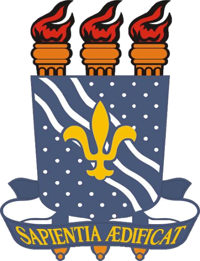

# ProjetoArq_UC

	 
	
	 

Uma unidade de controle (CU) lida com todos os sinais de controle do processador. Ela dirige todos os fluxos de entrada e saída, busca código para instruções de microprogramas e direciona outras unidades e modelos fornecendo sinais de controle e temporização. Um componente CU é considerado o cérebro do processador porque ele emite ordens para praticamente tudo e garante a execução correta da instrução.
Neste relatório de projeto, foi implementado uma CPU, que busca, decodifica e junto com a Unidade de Controle,(responsável por gerar todos os sinais que controlam as operações no exterior da CPU), executa as instruções. 
Foi implementado em alto nível, java, a especificação de linguagem de baixo nível, assembly, de modo que, podemos simular o sistema de uma CPU, que reconhece a mesma.  
 

	 
	
	 

